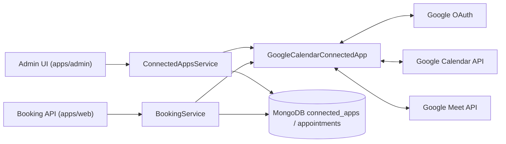

# Google Calendar Integration Architecture (Sectioned)

## 1) Scope and Capabilities

Google Calendar app (`google-calendar`) is an **OAuth** integration with these scopes in app definition:

- `calendar-read`
- `calendar-write`
- `meeting-url-provider`

Implemented by `GoogleCalendarConnectedApp`, which provides:

- OAuth connect/redirect handling.
- Busy-time reads for availability.
- Calendar writer operations (create/update/delete events).
- Meeting URL generation via Google Meet.
- Setup actions (`get-calendar-list`, `set-calendar`, etc.) for selecting target calendar.

---

## 2) Main Components

---

## 3) OAuth + Token Lifecycle

1. Admin starts connect flow.
2. `getLoginUrl()` builds OAuth URL.
3. `processRedirect()` exchanges code for tokens.
4. Access/refresh tokens are encrypted before persistence.
5. Runtime calls decrypt tokens; refresh path rotates and re-encrypts.

Encryption behavior in service:

- Stores encrypted: `access_token`, `refresh_token`.
- Runtime decrypt for API usage.
- On refresh, writes encrypted rotated tokens back to connected app.

---

## 4) Availability (Busy Events) on Web

Google Calendar contributes to availability through `calendar-read`:

- `BookingService.getAvailability()` -> `getBusyTimes()`.
- `BookingService` resolves `calendarSources` configured by admin.
- For each source app, it calls `ICalendarBusyTimeProvider.getBusyTimes(...)`.
- For Google Calendar source, `GoogleCalendarConnectedApp.getBusyTimes(...)` is used.

Result: external Google events block public booking slots.

---

## 5) Meeting URL Flow (Google Meet)

For online options with this app selected as `meetingUrlProviderAppId`:

- `BookingService.createAppointment()` calls `service.getMeetingUrl(...)`.
- `GoogleCalendarConnectedApp.getMeetingUrl(...)` creates a Meet space via Google Meet API.
- Appointment stores `meetingInformation` (url/id/type).

---

## 6) Calendar Writer Flow

Google app supports calendar write actions used by internal calendar writer flows:

- `createEvent(...)`
- `updateEvent(...)`
- delete event operations in service

This keeps external Google calendar in sync with appointment lifecycle when configured.

---

## 7) App Roles (Admin / Web / Job Processor / Notification Sender)

- **`apps/admin`**: OAuth connect + calendar selection (`get-calendar-list`, `set-calendar`).
- **`apps/web`**: booking-time meeting link creation + availability reads (busy events).
- **`apps/job-processor`**: not the primary path for Google meeting creation/busy-time reads; those are synchronous service calls.
- **`apps/notification-sender`**: no direct Google API calls; sends notifications with already-persisted appointment data.
