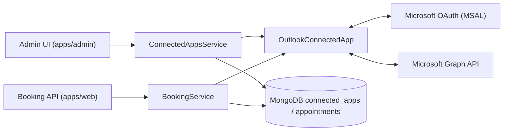

# Outlook Integration Architecture (Sectioned)

## 1) Scope and Capabilities

Outlook app (`outlook`) is an **OAuth** integration with:

- `calendar-read`
- `calendar-write`
- `mail-send`
- `meeting-url-provider`

`OutlookConnectedApp` implements:

- OAuth connect/redirect.
- Busy-time reads from Microsoft Graph.
- Calendar writer create/update.
- Mail sending (`sendMail`).
- Meeting URL generation (`/me/onlineMeetings`).

---

## 2) Main Components

---

## 3) OAuth + Token Lifecycle

1. Admin starts OAuth connect.
2. `getLoginUrl()` returns Microsoft authorization URL.
3. `processRedirect()` exchanges auth code for tokens.
4. Tokens are encrypted before storing in connected app token payload.
5. Runtime decrypts token for Graph calls and refreshes/rotates when needed.

---

## 4) Availability and Booking

Outlook provides busy-time data through `getBusyTimes(...)`.

Path:

- `apps/web /api/availability` -> `BookingService.getAvailability()`.
- `BookingService.getBusyTimes(...)` aggregates DB events + source apps.
- Outlook source app returns busy events; these block booking slots.

---

## 5) Meeting URL + Mail

For online options using Outlook as meeting provider:

- `BookingService` calls `getMeetingUrl(...)`.
- Outlook app creates online meeting via Graph `/me/onlineMeetings`.

For notification/mail use cases with Outlook app:

- `sendMail(...)` sends mail through Graph `/me/sendMail`.
- Supports attachments and ICS payload handling in service.

---

## 6) Calendar Writer Sync

Outlook app exposes:

- `createEvent(...)`
- `updateEvent(...)`

These are used for calendar synchronization scenarios where appointments are reflected in external Outlook calendar.

---

## 7) App Roles (Admin / Web / Job Processor / Notification Sender)

- **`apps/admin`**: OAuth install/reconnect and status polling.
- **`apps/web`**: busy-time reads for availability + meeting URL generation during booking.
- **`apps/job-processor`**: not the main path for Outlook meeting creation or availability; those happen in normal service calls.
- **`apps/notification-sender`**: no direct Outlook API calls unless app-specific notifications route through configured mail sender elsewhere.
