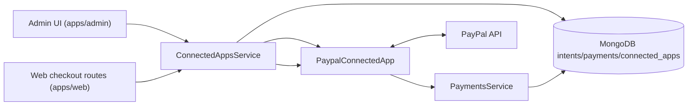

# PayPal Integration Architecture (Sectioned)

## 1) Scope and Capabilities

PayPal app (`paypal`) is a **basic** app (not OAuth) with:

- `payment`

`PaypalConnectedApp` implements:

- Configuration processing (`processRequest`) for client/secret + button options.
- Payment app calls (`processAppCall`) for order create/capture.
- Refund processing (`refundPayment`).

Unlike OAuth apps, PayPal credentials are entered in setup form and stored encrypted in app data.

---

## 2) Main Components

---

## 3) Configuration + Secret Handling

`processRequest(...)`:

- Validates app configuration payload.
- Encrypts `clientId` / `secretKey` before persistence.
- Supports masked secret behavior in update forms (`MASKED_SECRET_KEY`) so unchanged secrets are not re-entered.

At runtime, service decrypts credentials to call PayPal API.

---

## 4) Checkout App Calls

`processAppCall(...)` handles:

- `POST /orders` -> `createOrder(...)`
- `POST /orders/capture` -> `captureOrder(...)`

Flow:

1. Lookup internal payment intent.
2. Create/capture PayPal order.
3. Write external IDs and status updates via `PaymentsService.updateIntent(...)`.

---

## 5) Refund Flow

- `PaymentsService.refundPayment(...)` delegates to app `refundPayment(...)`.
- PayPal app retrieves order/capture details and submits capture refund.
- Result is returned to internal payment pipeline for final state updates.

---

## 6) App Roles (Admin / Web / Workers)

- **`apps/admin`**: configuration form entry and updates (client/secret/button settings).
- **`apps/web`**: checkout app calls for create/capture flows.
- **`apps/job-processor`**: not required for core PayPal create/capture flow.
- **`apps/notification-sender`**: unrelated to PayPal processor calls.
