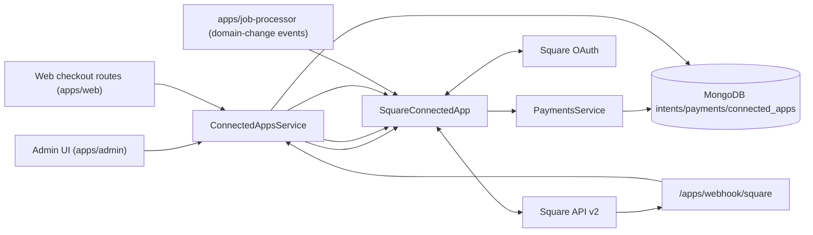

# Square Integration Architecture (Sectioned)

## 1) Scope and Capabilities

Square app (`square`) is an **OAuth** payment integration with:

- `payment`
- subscribes to `ORGANIZATION_DOMAIN_CHANGED_EVENT_TYPE`

`SquareConnectedApp` implements:

- OAuth connect/redirect.
- Payment app call endpoint (`processAppCall`, `pay` flow).
- Static webhook processing with signature verification.
- Refund processing.
- Event subscriber for domain-change Apple Pay registration refresh.

---

## 2) Main Components

---

## 3) OAuth + Merchant Token Handling

On OAuth redirect:

- App exchanges code for Square tokens and merchant metadata.
- Stores encrypted `accessToken`/`refreshToken`.
- Stores merchant identity in app data/account metadata.

Runtime payment/webhook operations decrypt and refresh merchant tokens as needed.

---

## 4) Checkout App Call (`pay`)

`processAppCall(...)` supports `POST /pay`:

1. Parse payment intent + source id.
2. Create Square payment (`/v2/payments`).
3. Update internal payment intent with processor external ID/status.

This ties internal Timeli payment lifecycle to Square transaction lifecycle.

---

## 5) Static Webhook + Fees

`processStaticWebhook(...)`:

- Verifies signature (HMAC + notification URL).
- Parses `payment.updated` payloads.
- Resolves internal payment by external payment ID.
- Applies/updates processing fees on payment record.

---

## 6) Refund Flow

- `PaymentsService.refundPayment(...)` delegates to Square app for eligible online payments.
- Square app calls refunds API and returns success/error.

---

## 7) Event-Driven Domain Handling

Square app reacts to organization domain changes:

- `onEvent(...)` for `ORGANIZATION_DOMAIN_CHANGED_EVENT_TYPE`.
- Re-registers Apple Pay domain.
- Also executes initial registration in `afterOAuthConnected(...)`.
