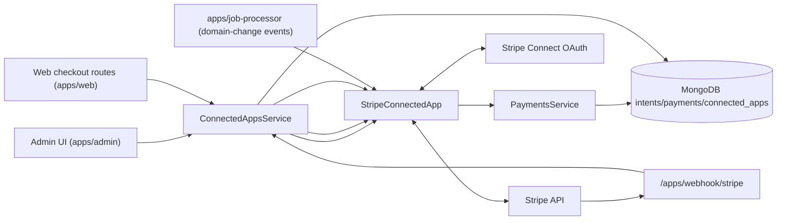

# Stripe Integration Architecture (Sectioned)

## 1) Scope and Capabilities

Stripe app (`stripe`) is an **OAuth** payment integration with:

- `payment`
- subscribes to `ORGANIZATION_DOMAIN_CHANGED_EVENT_TYPE`

`StripeConnectedApp` implements:

- OAuth connect/redirect.
- Payment processor endpoints (`processAppCall`) for create/confirm payment intent.
- Static webhook processing (`processStaticWebhook`) for Stripe events.
- Refund processing (`refundPayment`).
- Event subscriber behavior (`onEvent`) for domain-change Apple Pay registration refresh.

---

## 2) Main Components

---

## 3) OAuth + Token Storage

OAuth redirect flow stores encrypted token fields in connected app record:

- `token.accessToken` encrypted.
- `token.refreshToken` encrypted.
- Connected Stripe account ID stored in app data.

This app uses connected-account context to execute payment operations.

---

## 4) Checkout App Calls

`processAppCall(...)` handles payment endpoints:

- `create-payment-intent`
- `confirm-payment`

Flow:

1. Web/API calls `/apps/{appId}/...` route.
2. `ConnectedAppsService.processAppCall(...)` dispatches to Stripe app.
3. Stripe app updates internal payment intent (`PaymentsService.updateIntent`), including external Stripe IDs.

---

## 5) Webhooks + Fee Synchronization

`processStaticWebhook(...)` validates signature and handles Stripe events such as:

- `payment_intent.succeeded`
- `payment_intent.payment_failed`
- charge-related fee events

Webhook path resolves internal intent/payment and updates statuses/fees in MongoDB via `PaymentsService`.

---

## 6) Refund Flow

- `PaymentsService.refundPayment(...)` delegates to app-specific `refundPayment(...)` for online Stripe payments.
- Stripe app executes Stripe refund API calls and reports success/failure.

---

## 7) Event-Driven Domain Handling

Stripe app subscribes to organization domain changes:

- `onEvent(...)` listens for domain change.
- Re-registers Apple Pay domain (also run after OAuth connect via `afterOAuthConnected`).

This event path is typically executed via queued event delivery (job processor pipeline).
