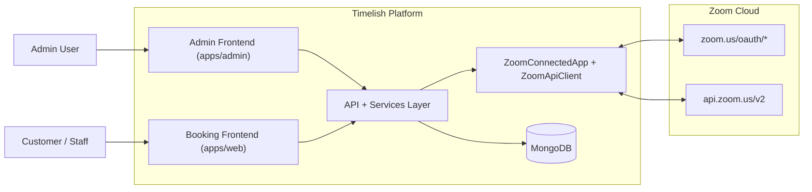
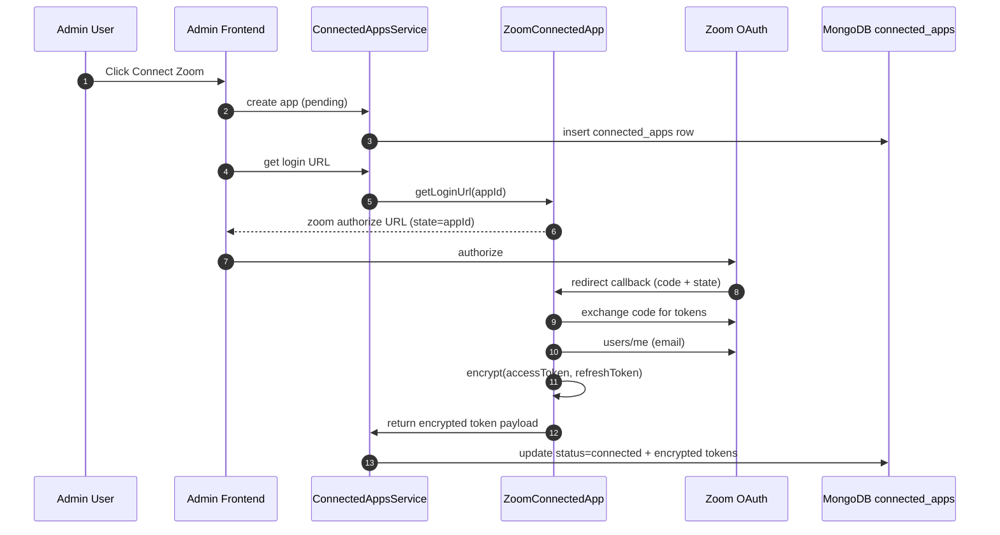
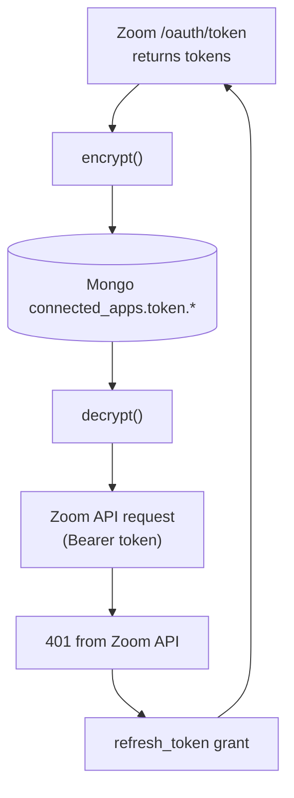
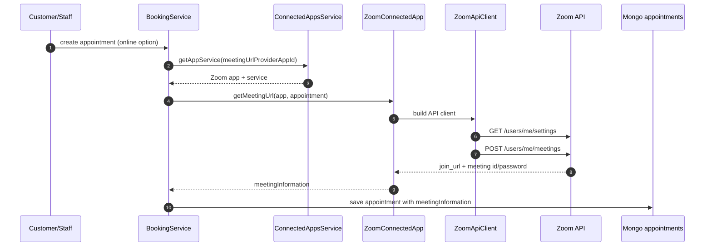
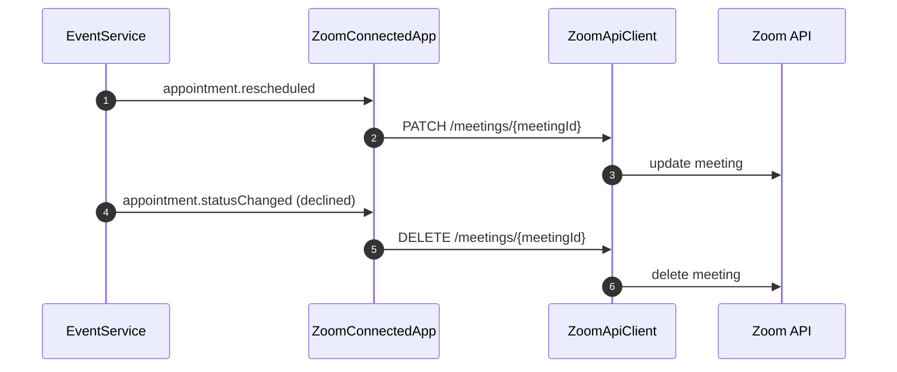
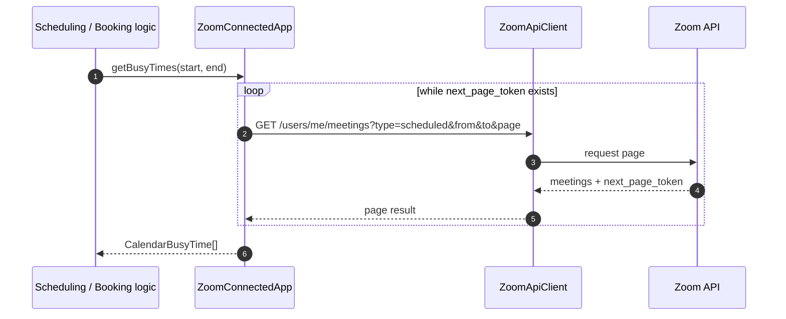
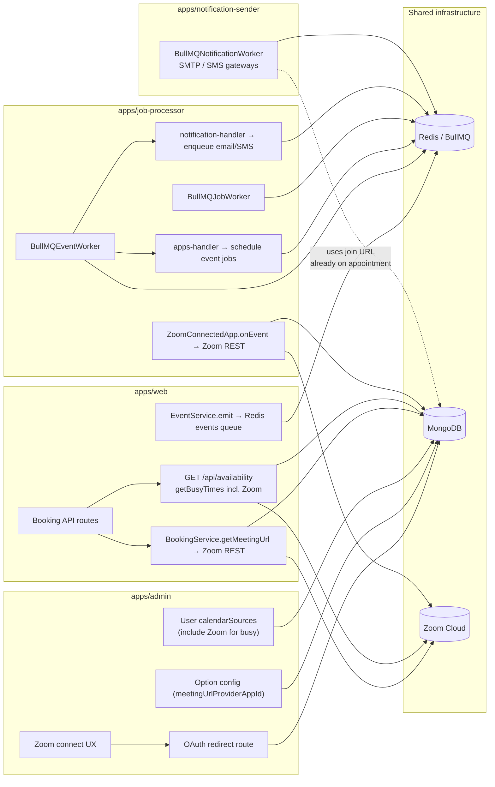

# Zoom Integration Architecture (Detailed, Sectioned)

This document describes how Zoom is integrated into Timelish as a connected OAuth app.
It is split into focused sections so each part of the architecture is readable on its own.

## 1) What This Integration Does

The Zoom app integration supports:

- OAuth connection from admin UI.
- Creating Zoom meetings when online appointments are booked.
- Updating or deleting Zoom meetings when appointment status changes.
- Reading Zoom meetings to provide busy-time data.
- Refreshing OAuth tokens and rotating persisted encrypted tokens.

Primary modules (see also §8 deployable apps):

- `packages/app-store/src/apps/zoom/` — Zoom OAuth, API client, meeting lifecycle, busy times.
- `packages/services/` — shared services (`ConnectedAppsService`, `BookingService`, event + job queues, notifications).
- `apps/admin`, `apps/web`, `apps/job-processor`, `apps/notification-sender` — runtime entry points described below.

---

## 2) High-Level Component View

This section shows the major systems and dependencies.

---

## 3) OAuth Connection Flow

### What this represents

How an admin connects Zoom from the UI, how code/state are processed, and where encrypted tokens are persisted.

### Logic summary

1. Admin starts connection in setup UI.
2. App record is created as `pending` in `connected_apps`.
3. User is redirected to Zoom authorization URL.
4. Zoom redirects back with `code` + `state` (`appId`).
5. Backend exchanges code for tokens and reads `users/me`.
6. Tokens are encrypted and stored in DB; app status becomes `connected`.

---

## 4) Token Storage and Security Model

### What this represents

How OAuth tokens are handled in memory and at rest.

### Data model notes (`connected_apps`)

- `token.accessToken`: encrypted before DB write.
- `token.refreshToken`: encrypted before DB write.
- `token.expiresOn`: expiry timestamp.
- `account.username`: resolved Zoom email.

### Encryption/decryption lifecycle

- During OAuth connect: raw tokens from Zoom -> `encrypt()` -> DB.
- During API calls: token loaded from DB -> `decrypt()` in runtime only.
- On refresh: new tokens from Zoom -> `encrypt()` -> overwrite previous token values.

Token fields in DB are encrypted at rest:

- `token.accessToken` (encrypted)
- `token.refreshToken` (encrypted)
- `token.expiresOn` (timestamp)

---

## 5) Booking -> Meeting Creation Flow

### What this represents

How a booked online appointment receives a Zoom meeting link.

### Logic summary

1. Booking request enters `BookingService`.
2. Service resolves meeting provider app via `meetingUrlProviderAppId`.
3. `ZoomConnectedApp.getMeetingUrl()` creates meeting in Zoom.
4. `meetingInformation` is saved in appointment document.

---

## 6) Appointment Change Propagation

### What this represents

How appointment events are synchronized to Zoom after booking.

### Logic summary

- `appointment.rescheduled` -> PATCH Zoom meeting.
- `appointment.statusChanged` to `declined` -> DELETE Zoom meeting.

---

## 7) Busy-Time Read Flow

### What this represents

How Zoom meetings are read and transformed into busy slots.

### Logic summary

1. Service calls `getBusyTimes(start, end)`.
2. Zoom meetings are fetched page-by-page.
3. Results are mapped to `CalendarBusyTime[]` using configured timezone.

---

## 8) Deployable apps—how each participates (Zoom-specific)

Four separate apps share the same `packages/services` codebase but host different workloads. Zoom touches them in distinct ways.

### `apps/admin` (Admin UI + server routes)

Role for Zoom:

- **Connect / reconnect Zoom**: installs the Zoom connected app (`pending`), opens OAuth popup, polls status until `connected`.
- **OAuth redirect handling**: `/apps/oauth/zoom/redirect` runs `ConnectedAppsService.processRedirect` — token exchange with Zoom, `encrypt()` on secrets, persist to MongoDB `connected_apps`.
- **Configuration**: admins choose which installed app acts as **`meetingUrlProviderAppId`** for each online **service option** (this link is what triggers Zoom meeting creation on booking).
- **Busy times / availability**: Zoom declares the **`calendar-read`** capability and implements **`getBusyTimes`** (scheduled Zoom meetings → busy intervals). In admin, Zoom can be added as a **`calendarSources` entry for user** (per-user calendar sources stored in MongoDB). That wires Zoom into the same busy-collection path `BookingService` uses for **public availability** (`apps/web` — details below).
- **Indirect**: any admin action that emits domain events uses the same event pipeline as `web`; Zoom side effects ultimately still flow through **`job-processor`** (see below), not staying only inside admin.

Zoom **does not** run “inside admin” permanently; admin is primarily **OAuth + wiring + UX**.

### `apps/web` (Public booking frontend + API routes)

Role for Zoom:

- **Booking request path**: public booking endpoints invoke `BookingService`. For an online option with `meetingUrlProviderAppId` set to the Zoom installation, **`getMeetingUrl` runs synchronously in that request**, calls Zoom REST API (`POST /users/me/meetings`), and stores `meetingInformation` (join URL, Zoom meeting id, password) **on the appointment before the response**.
- **Availability / busy slots**: public **`GET /api/availability`** calls `bookingService.getAvailability()`, which loads busy intervals via **`BookingService.getBusyTimes`**. That merges:
  - existing **appointments** in MongoDB,
  - plus **`getBusyTimes` from each app listed in calendar sources** (IDs resolved from the user’s **`calendarSources`**). When Zoom is one of those sources, **`ZoomConnectedApp.getBusyTimes`** queries Zoom (**paginated `/users/me/meetings`, type scheduled**) so **your Zoom calendar blocks booking slots shown on web**.
- **Event emission afterwards**: booking uses `EventService.emit` backed by **`BullMQEventService`** — envelopes go to Redis’s **events** queue rather than invoking every subscriber inline in-process for long-running work.

So **web creates the Zoom meeting** (first touch to Zoom API for a new booking) but **delegates cascade side effects** (other apps, reschedule propagation jobs, etc.) to the async pipeline. **Fetching busy events for availability is synchronous in the web server request** (same process as `BookingService`); it is **not** routed through `job-processor`.

### `apps/job-processor` (BullMQ workers: events + jobs)

Role for Zoom:

Runs two workers (`BullMQEventWorker`, `BullMQJobWorker`):

1. **Events queue**: `apps-handler` runs here. When an envelope matches installed apps subscribed to `appointment.*` (Zoom subscribes), it **`scheduleJob` with type `event`** — one queued **event-delivery job per Zoom installation** concerned by that envelope.
2. **Jobs queue**: for each queued event job, **`processEventDeliveryJob`** loads `ZoomConnectedApp` and runs **`onEvent`** with the decrypted-in-memory token path. That executes **PATCH** (reschedule) and **DELETE** (declined) against Zoom REST API as implemented in `packages/app-store/src/apps/zoom/service.ts`.

In short: **admin/web enqueue work**; **`job-processor` is where Zoom reacts to reschedule/cancellation** (and any other Zoom `onEvent` behavior). Without this process running + Redis healthy, queued side effects backlog. **Zoom busy-time reads for availability do not use this worker** — they run when `apps/web` calls `BookingService.getAvailability` / `getBusyTimes`.

Also note: **`notification-handler` runs inside the event worker**, so it participates in the _same event job_ — it does not talk to Zoom; it pushes email/SMS work to notification queues.

### `apps/notification-sender` (BullMQ notification worker)

Role for Zoom:

- **Indirect only**: consumes **email** and **text message** queues written by **`BullMQNotificationService`**.
- Appointment confirmation/reminder payloads typically include **`meetingInformation.url`** already stored when `web` (or whoever created the appointment) called Zoom; **notification-sender does not call Zoom** and does **not** need Zoom credentials.

Operational separation improves reliability: Zoom API failures do not equal mail delivery outages, and vice versa.

---

## 9) Operational Notes

- Zoom dependency surface:
  - OAuth: `https://zoom.us/oauth/authorize`, `https://zoom.us/oauth/token`
  - API: `https://api.zoom.us/v2`
- Failure handling:
  - OAuth/API failures set app status to `failed` with statusText key.
  - Meeting update/delete failures are logged and status can be updated to failed.
- Token resilience:
  - Automatic refresh + retry once on `401`.
  - Refreshed tokens are rotated and re-encrypted before persistence.
